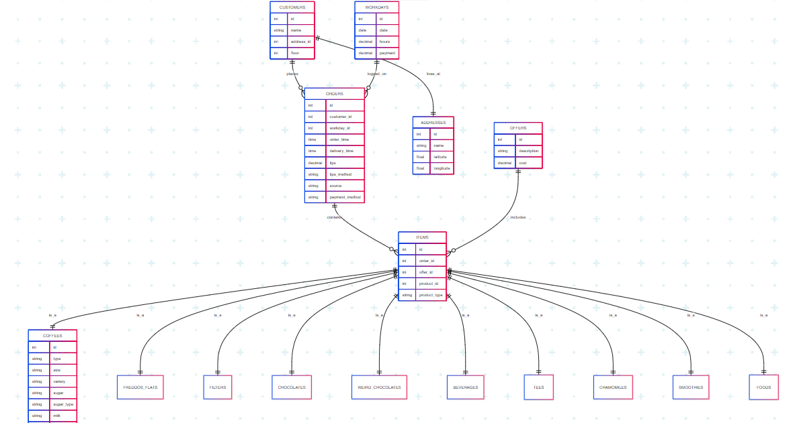

# Design Document

By Antonios Roussos

Video overview: <https://www.youtube.com/watch?v=6vsZgzt26M4&ab_channel=ra>

## Scope

**Purpose of the Database:**
The purpose of this database is to support the backend infrastructure of a coffee shop's ordering system for a local delivery business.

**Included in Scope:**
- People: Customers
- Places: Delivery addresses
- Things: Orders, items, products (e.g., coffees, teas, chocolates), work logs, special offers, costs

**Outside the Scope:**
- Real-time delivery tracking
- Inventory stock levels
- Employee identity and payroll management

## Functional Requirements

**Supported Functionality:**
- Track customer information and addresses
- Log and retrieve orders and order contents
- Customize product options (milk, sugar, extras)
- Record workdays and payments
- Manage promotional offers
- Query summarized order data via views

**Outside Functionality:**
- Live order progress or status updates
- Automated stock deduction or alerts
- Employee shift management

## Representation

### Entities

**Entities Represented:**
- `customers` (name, address_id, floor)
- `addresses` (name, latitude, longitude)
- `orders` (customer_id, workday_id, time fields, tips)
- `items` (order_id, offer_id, product_id, product_type)
- `offers` (description, cost)
- `workdays` (date, hours, payment)
- Product Tables: `coffees`, `freddos_flats`, `filters`, `chocolates`, `weird_chocolates`, `beverages`, `tees`, `chamomiles`, `smoothies`, `foods`

**Why These Types and Constraints:**
- ENUMs are used for categorical fields (e.g., product variations) for consistency and integrity.
- DECIMAL fields for financial precision (costs, payments).
- Foreign keys ensure relational integrity.
- Nullable fields allow optional customization like milk or sugar.

### Relationships

**Entity Relationship Description:**
- A `Customer` belongs to an `Address`
- An `Order` belongs to a `Customer` and a `Workday`
- An `Order` has many `Items`
- An `Item` may optionally reference an `Offer`
- An `Item` polymorphically points to one product table (via `product_id`, `product_type`)

**Entity Relationship Diagram:**

## Optimizations

- **Index:** `orders.customer_id` for faster customer-based queries
- **View:** `v_orders_summary` to simplify complex joins for reporting
- **Trigger:** `trg_check_tips_method` enforces data consistency between `tips` and `tips_method`

## Limitations

- **Polymorphic Design:** Hard to join generically across product tables
- **Static ENUMs:** Adding new options requires altering schema
- **No Stock Tracking:** No mechanism to track inventory availability
